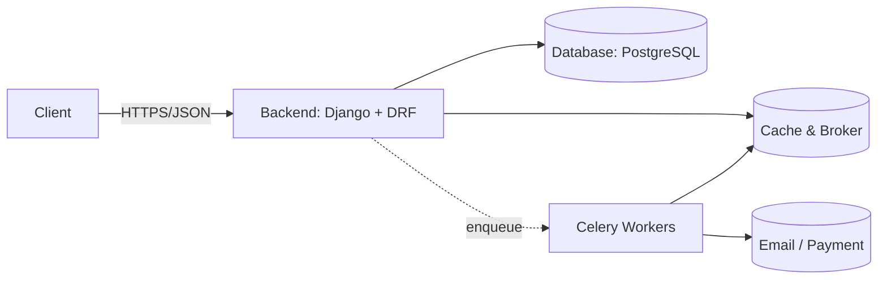

<h1 align="center">Hi, I'm Mohammad Yousefi — Backend Developer (Python/Django)</h1>

I build clean, testable APIs with Django & DRF, ship with Docker, and scale background jobs with Celery/Redis.

---

### 🚀 مهارت‌ها
- Django / Django REST Framework  
- PostgreSQL / Redis  
- Celery (Tasks, Retries, Chains)  
- Docker / Docker Compose  
- Testing: pytest / coverage  
- CI/CD: GitHub Actions  
- Git

---

### 🧩 پروژه‌های شاخص
#### 🛒 [Custom-Shop-Project](https://github.com/MohammadYR/Custom-Shop-Project)
بک‌اند فروشگاهی کامل با JWT/OTP، Docker، Celery/Redis و API Docs.  
**Tech Stack:** Django, DRF, PostgreSQL, Redis, Celery, Docker, Pytest

#### ⚙️ Celery Patterns Pack *(به‌زودی)*
الگوهای حرفه‌ای برای تسک‌ها، retries، و signal handling در Celery.

---

### 🧠 Architecture (نمونه تصویری)

---

## 📊 آمار گیت‌هاب من

  
  

---

## 🧱 فعالیت اخیر من

  

---

## 🏆 افتخارات

  

---

## ⚙️ ابزارهایی که بیشتر باهاشون کار می‌کنم

  

